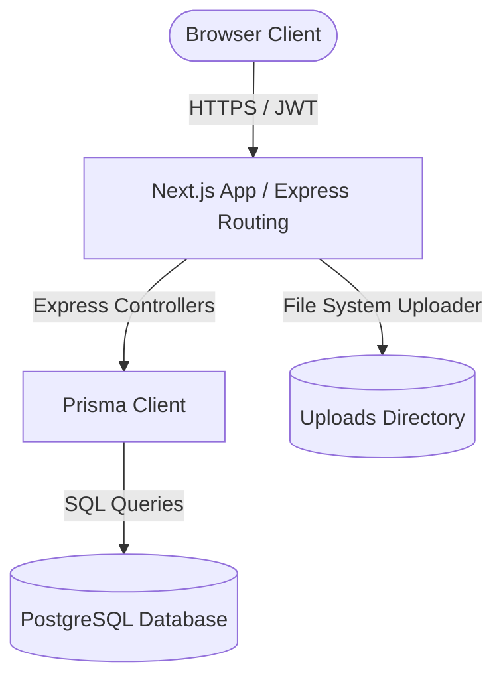

# CyberKavach 2.0 — Comprehensive System Specification & Architecture Document

This document provides a detailed technical specification of the **CyberKavach 2.0** digital operations platform. It covers the system architecture, design tokens, frontend routes, form validation animations, backend REST API routes, Prisma PostgreSQL models, and analytical reporting features.

---

## 1. Executive Summary & Design Aesthetics

**CyberKavach 2.0** is a centralized operational command center designed for technical cybersecurity clubs. It facilitates real-time event coordination, team formation, automated attendance tracking via QR-telemetry, cryptographic certificate generation, gamified member leaderboard tracking, multi-level hierarchy approvals, and public landing page administration.

### Design Paradigm: SpaceX Cybersecurity Theme
The entire interface is built using a dark-mode theme utilizing high-contrast, premium accents matching aerospace dashboards:
* **Background Color**: `#05070A` (Near Black Deep Space)
* **Accent Colors**: 
  * `Neon Lime (#CCFF00)` — Primary indicators, verified status, active links, and checkout points.
  * `Burn Orange (#FF4D00)` — Secondary alerts, pending approvals, timeline milestones, and actions.
  * `Hot Red (#FF003C)` — Security errors, access denial warning banners, and deactivation toggles.
  * `Dark Slate / Charcoal (#0D0F14)` — Primary card bodies and interactive controls.
* **Layout Grid**: 12-column responsive flex layouts, monospaced metadata labels, glowing corner indicators, scanline animations, and clean, non-overlapping layouts optimized for density and readability.

---

## 2. System Architecture Overview

CyberKavach 2.0 is structured as a decoupled monorepo:
* **Frontend**: Next.js App Router (v16.2.6), Tailwind CSS v4, Framer Motion for animations, and Lucide React icons.
* **Backend**: Node.js Express server configured with TypeScript (tsc), Prisma client, JWT authentication, and local multer upload streaming.
* **Database**: PostgreSQL storing users, events, check-ins, certificates, gamification logs, notifications, and club settings.

---

## 3. Database Schema Mapping (Prisma Models)

The data layer is defined in [schema.prisma](file:///c:/cyberkavach2.0/server/prisma/schema.prisma) and maps out all key models, enums, and relations:

### 3.1. Enumerations

| Enum Name | Enum Values | Description |
| :--- | :--- | :--- |
| `Role` | `FACULTY`, `STUDENT_COORDINATOR`, `TECH`, `CONTENT`, `SOCIAL_MEDIA`, `MEMBER`, `GUEST` | Controls authorization levels across the system. |
| `ApprovalStatus` | `PENDING`, `UNDER_REVIEW`, `APPROVED`, `REJECTED` | Status for multi-level club requests. |
| `ApprovalType` | `EVENT_PERMISSION`, `RESOURCE_VENUE`, `BUDGET`, `SOCIAL_MEDIA_POST`, `CONTENT_PUBLISH`, `CERTIFICATE_AUTH`, `EXTERNAL_COLLAB` | Types of approval requests. |
| `AttendanceType` | `CHECK_IN`, `CHECK_OUT` | HUD check-in categories. |
| `CertificateStatus` | `PENDING`, `GENERATING`, `GENERATED`, `FAILED` | Issuance progression statuses. |
| `NotificationType` | `APPROVAL_UPDATE`, `EVENT_REMINDER`, `TEAM_UPDATE`, `POINTS_RECEIVED`, `BADGE_EARNED`, `SYSTEM`, `ACCOUNT_APPROVED` | Routing for client notifications. |

### 3.2. Core Entities

#### User Model (`users`)
Represents members, coordinators, and administrators in the system.
* `id` (String, UUID, PK)
* `email` (String, Unique)
* `passwordHash` (String)
* `name` (String)
* `studentId` (String, Nullable, Unique)
* `phone` (String, Nullable)
* `department` (String, Nullable)
* `institute` (String, Nullable)
* `semester` (String, Nullable)
* `role` (Role, Default: `GUEST`)
* `avatarUrl` (String, Nullable)
* `isActive` (Boolean, Default: `true`)
* `isApproved` (Boolean, Default: `false`)
* `createdAt` (DateTime)

#### Event Model (`events`)
Maintains the timeline, venue, guidelines, capacity, and tags for cyber events.
* `id` (String, UUID, PK)
* `title` (String)
* `description` (String, Nullable)
* `venue` (String, Nullable)
* `startDate` (DateTime)
* `endDate` (DateTime)
* `registrationDeadline` (DateTime, Nullable)
* `posterUrl` (String, Nullable)
* `slug` (String, Unique)
* `rules` (String, Nullable)
* `tags` (String[])
* `minTeamSize` (Int, Nullable)
* `maxTeamSize` (Int, Nullable)
* `isPublished` (Boolean, Default: `false`)
* `isApproved` (Boolean, Default: `true`)
* `maxCapacity` (Int, Nullable)
* `eventType` (String, Default: `general`)

#### Team Model (`teams`)
Allows members to collaborate on hackathons and contests.
* `id` (String, UUID, PK)
* `name` (String)
* `teamCode` (String, Unique)
* `qrCode` (String, Nullable)
* `leaderId` (String, FK to User)
* `eventId` (String, FK to Event)

#### Attendance Model (`attendance`)
Stores real-time QR check-in and check-out tracking logs.
* `id` (String, UUID, PK)
* `type` (AttendanceType)
* `timestamp` (DateTime)
* `isLate` (Boolean, Default: `false`)
* `isEarly` (Boolean, Default: `false`)
* `userId` (String, FK to User)
* `eventId` (String, FK to Event)

#### Certificate Template & Issuance Models (`certificate_templates`, `certificates`)
Handles cryptographic digital credentials.
* **Template**:
  * `id` (String, UUID, PK)
  * `name` (String)
  * `fileUrl` (String)
  * `fields` (Json)
* **Certificate**:
  * `id` (String, UUID, PK)
  * `uniqueCode` (String, Unique)
  * `recipientName` (String)
  * `fileUrl` (String, Nullable)
  * `status` (CertificateStatus)
  * `generatedAt` (DateTime, Nullable)

#### Appreciation Points & Badges (`appreciation_points`, `badges`, `user_badges`)
Powers gamification rewards.
* **AppreciationPoint**:
  * `id` (String, UUID, PK)
  * `points` (Int)
  * `category` (String)
  * `reason` (String, Nullable)
  * `isDeduction` (Boolean, Default: `false`)
  * `receiverId` (String, FK to User)
* **Badge**:
  * `id` (String, UUID, PK)
  * `name` (String, Unique)
  * `pointThreshold` (Int)
  * `icon` (String)

---

## 4. Frontend Routes & Interactive Modules

### 4.1. Navigation Layout & Bottom-Right Toast Alert
* **Sidebar Layout**: Responsive monospaced sidebar containing dynamic glow active state navigation matching role-based clearance.
* **Toast Notification**: Active slide-in alerts from the bottom-right.
  * *Features*: Includes inline "Mark as Read" trigger (calls backend endpoint), "Acknowledge & Redirect" to notifications feed, and local preference storage (`ck_disable_notification_popups`) to toggle popup mute rules.

### 4.2. Events & Team Managers
* **Events Listing**: Stepper form utilizing calendar modules, drag-and-drop file dropzones, date validations, and a full-screen **"Operation Logged"** completion animation.
* **Event Details ([id])**: Displays analytics panels, registration growth timelines, team size charts, CSV exports, and structured member grids with custom codes.
* **Teams listings**: Dynamic creation modals, member search filters (verifying approval status before allowing addition), QR code downloads, team reuse triggers, and a green console-based **"Identity Cloned & Signed"** feedback animation.

### 4.3. HUD Attendance Console
* **Control Board**: Scanning system to record inbound and outbound logs.
* **Scanner Overlay**: Interactive camera scanners with Neon Lime scanlines, check-in thresholds, and telemetry sound alerts.

### 4.4. gamification & Matrix Leaderboard
* **Podiums**: Distinct columns for top 3 (Lime for 1st, Orange for 2nd, Red for 3rd) with floating trophy animations.
* **Credits Awards Form**: Search member inputs. Submitting awards displays flying SpaceX-color stars particles around the card container.
* **Profile Dossiers**: Highlights active badges and contribution logs. Submitting modifications triggers a circular biometric scanning verification interface.

---

## 5. Backend API Endpoints Directory

All communication between Frontend and Backend relies on REST endpoints secured with JWT tokens.

### 5.1. Authentication & Users (`/api/auth`, `/api/users`)

| Method | Endpoint | Authorization | Description |
| :--- | :--- | :--- | :--- |
| `POST` | `/auth/register` | Public | Registers a new account (role defaults to `GUEST`, `isApproved: false`). |
| `POST` | `/auth/login` | Public | Authenticates credentials and issues a JWT token. |
| `GET` | `/users` | Core Roles | Lists all approved users (supports name/role searches and pagination). |
| `PATCH` | `/users/:id/approve` | SC / Faculty | Grants club clearance approvals. |
| `PATCH` | `/users/:id/role` | SC / Faculty | Changes user authorization role. |
| `PATCH` | `/users/:id/deactivate` | SC / Faculty | Temporarily disables user access. |

### 5.2. Events & Registrations (`/api/events`)

| Method | Endpoint | Authorization | Description |
| :--- | :--- | :--- | :--- |
| `GET` | `/events` | Approved | Fetches published events list. |
| `GET` | `/events/all` | Core Roles | Lists drafts and pending events. |
| `POST` | `/events` | Coordinator+ | Creates a new event draft (includes poster upload). |
| `GET` | `/events/:id` | Core Roles | Fetches detailed metadata for a single event. |
| `PATCH` | `/events/:id/publish` | Coordinator+ | Publishes an approved event to the public view. |
| `GET` | `/events/:id/analytics` | Core Roles | Gathers registration timelines, check-in rates, and team sizes. |
| `GET` | `/events/:id/registrations/export` | Core Roles | Generates CSV list of registered participants. |

### 5.3. Teams (`/api/teams`)

| Method | Endpoint | Authorization | Description |
| :--- | :--- | :--- | :--- |
| `GET` | `/teams/my` | Member | Returns teams managed or joined by the current user. |
| `POST` | `/teams` | Member | Creates a new team for an event, allocates leader, and generates code. |
| `POST` | `/teams/:id/reuse` | Member | Clones team roster into a different event with a fresh code. |
| `GET` | `/teams/:id/qr` | Member | Generates PNG QR code for mobile event check-in validation. |

### 5.4. Attendance HUD (`/api/attendance`)

| Method | Endpoint | Authorization | Description |
| :--- | :--- | :--- | :--- |
| `POST` | `/attendance/scan` | Coordinator+ | Scans a team or user QR code, checks validity, and sets entry log. |
| `GET` | `/attendance/event/:eventId` | Core Roles | Retrieves chronological timeline logs of entries and departures. |

### 5.5. Certificate Issuance (`/api/certificates`)

| Method | Endpoint | Authorization | Description |
| :--- | :--- | :--- | :--- |
| `POST` | `/certificates/templates` | Faculty / SC | Uploads certificate template and defines text coordinate metrics. |
| `POST` | `/certificates/generate` | Faculty / SC | Initiates batch generation from template utilizing CSV recipient rosters. |
| `GET` | `/certificates/my-certificates` | Member | Lists all generated credentials earned by the member. |
| `GET` | `/certificates/:id/download` | Member | Streams the generated PDF/PNG credential to the client. |

---

## 6. Analytical Reports Engine

The reporting core operates by dynamically parsing relational PostgreSQL records:

### 6.1. Registration Growth Timeline Report
* **Calculation**: Aggregates `createdAt` timestamps from `EventRegistration` group-by dates.
* **Visualization**: Rendered on the client as a sequential bar chart. The chart width scale is relative to the peak registration volume day:
  $$\text{Bar Width \%} = \left(\frac{\text{Registrations on Date}}{\text{Max Registrations in Single Day}}\right) \times 100$$
* **SpaceX Color Styling**: Lime-orange progress gradients with monospaced numerical offsets.

### 6.2. Team Size Distribution Report
* **Calculation**: Resolves team counts by aggregating `TeamMember` counts linked to each unique team.
* **Visualization**: Grouped categories (e.g. "2 members", "3 members"). Styled with red-orange progress bars for rapid diagnostic view.

### 6.3. Check-In & Attendance Telemetry Report
* **Calculation**: Computes three core ratios from the `Attendance` table:
  1. **Checked In**: Distinct users with a `CHECK_IN` record.
  2. **Checked Out**: Distinct users with a matching `CHECK_OUT` record.
  3. **Late Arrivals**: Scans where `timestamp` exceeds the event's `startDate`.
* **Visualization**: HUD summary cards with lime green check marks and telemetry alerts.
